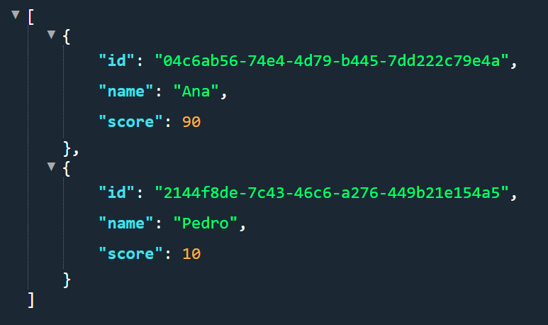
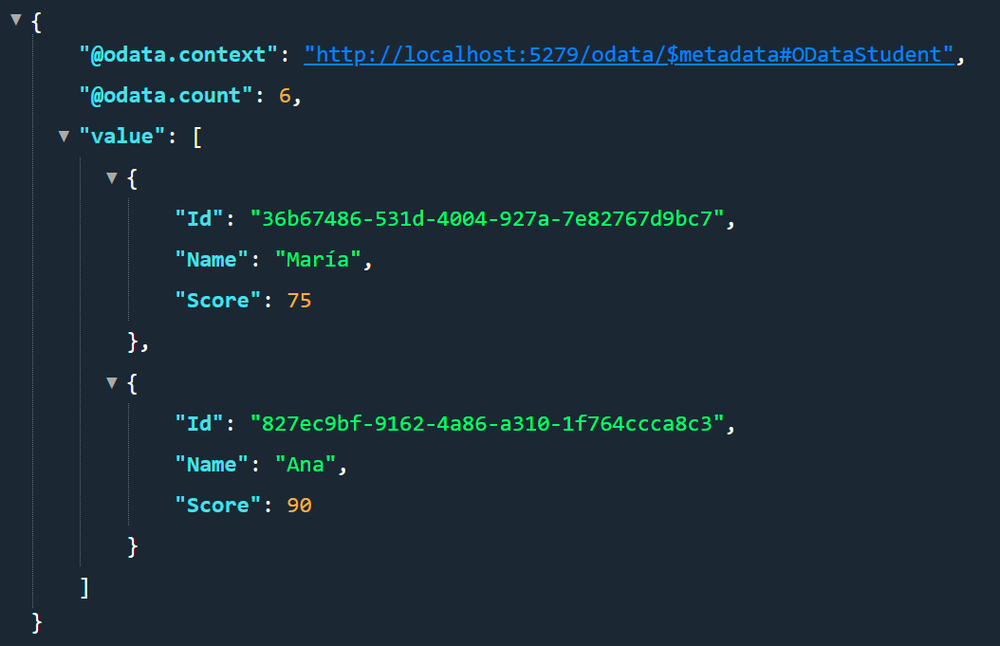

# EjemploOData

Proyecto probando OData con .NET 8

Agregamos el paquete
Microsoft.AspNetCore.OData 8.2.3

### Recursos

OData Manejo de seguridad y performance limitar queries y funcionalidad
https://learn.microsoft.com/en-us/odata/webapi/odata-security

Configurar Odata (ojo la parte de configurar ruta y middleware, no es necesaria)
https://learn.microsoft.com/en-us/odata/webapi-8/getting-started?tabs=net60%2Cvisual-studio-2022%2Cvisual-studio

### Endpoints
##### Odata metadata
http://localhost:5279/odata

http://localhost:5279/odata/$metadata

http://localhost:5279/odata/$metadata#Students

ver todos los endpoints de Odata y los que no
http://localhost:5279/$odata

##### Odata Students

Retorna todos los estudiantes (sin importar el limite que se le puso a top de 3, si se utiliza top entonces si te obliga a respetar el limite, a tener encuenta)
http://localhost:5279/api/Students

Retorna solo la propiedad ID de los estudiantes
http://localhost:5279/api/Students?$select=id

retorna solo la propiedad id de los estudiante, con una cantidad de 2 y saltando al primer estudiante
http://localhost:5279/api/Students?$select=id&$top=2&$skip=1

No funciona con el controlador que utilice el decorador Route y ApiController
http://localhost:5279/api/Students?$count=true

## Explicacion

se puede ver que el controlador **StudentsController**
funciona parcialmente la funcionalidad de OData ya que se puede usar select, top, skip, pero no funciona count

Este count, es necesario para poder hacer  una correcta paginacion, sabiendo cuantos elementos hay en total, si vamos a la siguiente URL podremos ver que no se muestra el count:

http://localhost:5279/api/Student?top=2&skip=1&count=true

Mientras que con el controlador que hereda de OData y ⚠️**sigue la nomenclatura de los metodos**⚠️ si funciona:

http://localhost:5279/odata/ODataStudent?top=2&skip=1&count=true

